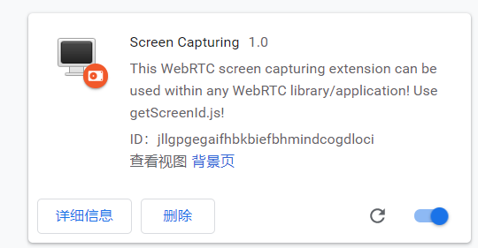
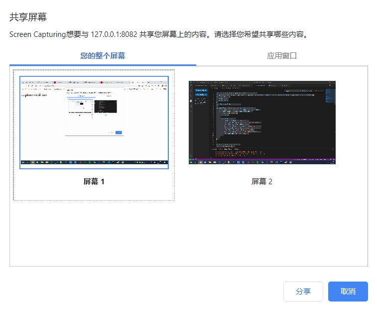

# WebRTC桌面共享--浏览器显示桌面
## chrome插件开发
chrome插件包含4个文件分别为
* manifest：插件的配置文件，命名为manifest.json，不可更改，其他部分的文件名可以修改，只需在此配置文件中更改配置即可。主要配置版本信息、文件索引信息等
* background：插件的后台程序
* content_scripts：后台background与浏览器网页通信，即background <--> content_scripts <--> web
* icons：插件图标

## 桌面共享插件（chrome）
首先在本地创建一个文件夹ChromePlugDesktopCapture(文件名随意)，然后创建4个文件：manifest.json、background-script.js、content-script.js、icon.png（图标就随便到网上找一个48x48的），编写相关代码：
* manifest.json
```json
{
    "name" : "Screen Capturing",
    "version" : "1.0",
    "manifest_version" : 2,
    "minimum_chrome_version": "34",
    "description" : "This WebRTC screen capturing extension can be used within any WebRTC library/application! Use getScreenId.js!",
    "homepage_url": "https://www.webrtc-experiment.com/getScreenId/",
    "background": {
        "scripts": ["background-script.js"],
        "persistent": false
    },
    "content_scripts": [ {
       "js": [ "content-script.js" ],
       "all_frames": true,
       "run_at": "document_end",
       "matches": ["https://*/*"]
    }],
    "icons" : {
        "48" : "icon.png"
    },
    "permissions": [
        "desktopCapture"
    ],
    "web_accessible_resources": [
        "icon.png"
    ]
}
```
* background-script.js
```js

'use strict';
const dataSources = ['screen', 'window'];
let desktopMediaRequestId = '';
chrome.runtime.onConnect.addListener(function(port) {
  port.onMessage.addListener(function(msg) {
    if (msg.type === 'SS_UI_REQUEST') {
      requestScreenSharing(port, msg);
    }
    if (msg.type === 'SS_UI_CANCEL') {
      cancelScreenSharing(msg);
    }
  });
});
function requestScreenSharing(port, msg) {
  // https://developer.chrome.com/extensions/desktopCapture
  // params:
  //  - 'dataSources' Set of sources that should be shown to the user.
  //  - 'targetTab' Tab for which the stream is created.
  //  - 'streamId' String that can be passed to getUserMedia() API
  desktopMediaRequestId =
      chrome.desktopCapture.chooseDesktopMedia(dataSources, port.sender.tab,
          function(streamId) {
            if (streamId) {
              msg.type = 'SS_DIALOG_SUCCESS';
              msg.streamId = streamId;
            } else {
              msg.type = 'SS_DIALOG_CANCEL';
            }
            port.postMessage(msg);
          });
}
function cancelScreenSharing() {
    port.postMessage({
        type: 'SS_cancelScreenSharing',
        text: 'start'
      }, '*');
  if (desktopMediaRequestId) {
    chrome.desktopCapture.cancelChooseDesktopMedia(desktopMediaRequestId);
  }
}
//alert('hello background');
```
* content-script.js
```js
'use strict';
// https://chromeextensionsdocs.appspot.com/
//   apps/content_scripts#host-page-communication
//     - 'content_script' and execution env are isolated from each other
//     - In order to communicate we use the DOM (window.postMessage)
//
// app.js            |        |content-script.js |      |background.js
// window.postMessage|------->|port.postMessage  |----->| port.onMessage
//                   | window |                  | port |
// webkitGetUserMedia|<------ |window.postMessage|<-----| port.postMessage
//
const port = chrome.runtime.connect(chrome.runtime.id);
port.onMessage.addListener(function (msg) {
  window.postMessage(msg, '*');
});
window.addEventListener('message', function (event) {
  // We only accept messages from ourselves
  if (event.source !== window) {
    return;
  }
  if (event.data.type && ((event.data.type === 'SS_UI_REQUEST') ||
      (event.data.type === 'SS_UI_CANCEL'))) {
    port.postMessage(event.data);
  }
}, false);
window.postMessage({
  type: 'SS_PING',
  text: 'start'
}, '*');
```
* 安装插件
打开Chrome浏览器，输入 chrome://extensions ，进入扩展程序页面，选择“**开发者模式**”，选择“**加载已解压的扩展程序**”，选择目录ChromePlugDesktopCapture，进行安装，安装完成后如下图：


## 采集程序
工程包含3个部分：https Server、index.html、client.js
* servers.js
```js
var https = require("https");
var fs = require("fs");
var nodeStatic = require('node-static')
var fileServer = new nodeStatic.Server();
var option = {
    key: fs.readFileSync("key.pem"),
    cert: fs.readFileSync("cert.pem")
};

server = https.createServer(option, function(request, response) {
    fileServer.serve(request, response);
});

server.listen(8082);
console.log("https server start: https://127.0.0.1:8082");
```

* index.html
```html
<!DOCTYPE html>
<head>
    <title>capture desktop Demo</title>
</head>
<body>
    <h1>capture desktop</h1>
    <video id='localVideo' autoplay></video>
    <script src='client.js'></script>
</body>
```

* client.js
```js
var localVideo = document.getElementById('localVideo');
var getUserMedia = (navigator.getUserMedia || navigator.webkitGetUserMedia || navigator.mozGetUserMedia || navigator.msGetUserMedia);
var constraints = {
    video: true,
    audio: false
};
var isExtensionInstalled = false;
window.addEventListener('message', function (event) {
    console.log('has message', event.data.type, event.data);
    if (event.origin != window.location.origin) {
        console.log('error');
        //return;
    }
    if (event.data.type) {
        if (event.data.type === 'SS_PING') {
            this.console.log('extension has been installed');
            this.isExtensionInstalled = true;
        } else if (event.data.type === 'SS_DIALOG_SUCCESS') {
            this.console.log('dialog success, show screen');
            startScreenStream(event.data.streamId);
        } else if (event.data.type === 'SS_DIALOG_CANCEL') {
            this.console.log('user cancel');
        }
    }
});
// judge if support getUserMedia
function hasUserMedia() {
    return !!(navigator.getUserMedia || navigator.webkitGetUserMedia ||
        navigator.mozGetUserMedia || navigator.msGetUserMedia);
}
function getUserMediaSuccess(stream) {
    //console.log('getUserMedia success', stream);
    localVideo.srcObject = stream;
}
function getUserMediaError(error) {
    console.log("getUserMedia error:", error);
}
function startScreenStream(streamId) {
    const constraints = {
        audio: false,
        video: {
            mandatory: {
                chromeMediaSource: 'desktop',
                chromeMediaSourceId: streamId,
                maxWidth: window.screen.width,
                maxHeight: window.screen.height
            }
        }
    };
    if (hasUserMedia()) {
        navigator.getUserMedia = navigator.getUserMedia || navigator.webkitGetUserMedia ||
            navigator.mozGetUserMedia || navigator.msGetUserMedia;
        navigator.getUserMedia(constraints, getUserMediaSuccess, getUserMediaError);
    } else {
        alert('The browser does not support getUserMedia');
    }
}
function main() {
    console.log('hello screen');
    if (!isExtensionInstalled) {
        console.log('extension has not been installed');
    }
    var audioConstraints = {
        audio: true,
        video: false
    };
    navigator.getUserMedia(audioConstraints, function (astream) {
        console.log('start');
        window.postMessage({
            type: 'SS_UI_REQUEST',
            text: 'start'
        }, '*');
    }, function (error) {
        console.error('failed to create audio stream ' + error);
        return;
    });
}
main();
```
## 测试
运行命令：
```sh
npm install node-static
node servers.js
```
打开chrome浏览器，访问：https://127.0.0.1:8082，弹出选择需要共享的屏幕内容：多屏幕、浏览器的某个内容，选择好后，点击“**分享**”，这样就可以显示桌面，如果进一步开发，与其他浏览器或设备共享，需添加RTCPeerConnection等，与摄像头处理相同。


## 参考
[入门chrome插件开发教程和经验总结](https://www.cnblogs.com/rubekid/p/11769395.html)

[基于浏览器 webrtc的PC屏幕共享](https://blog.csdn.net/yunjinwang/article/details/78851036)

[github参考代码](https://github.com/webrtc/samples/tree/gh-pages/src/content/extensions/desktopcapture): 
https://github.com/webrtc/samples/tree/gh-pages/src/content/extensions/desktopcapture

